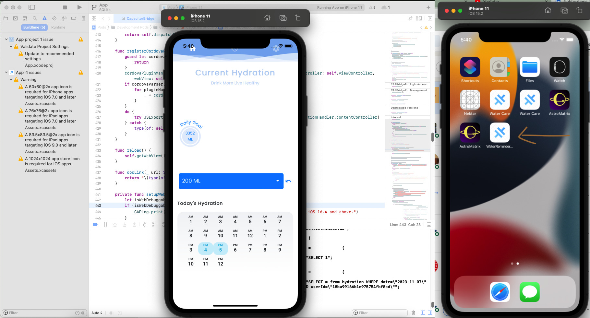

# 👋 Hi, I'm Farrukh Shahzad

I'm a highly skilled and energetic Full Stack Developer with 5+ years of experience building **responsive web** and **mobile applications**, **CRM systems**, **e-commerce platforms**, **IoT solutions**, and **API development**. I specialize in delivering high-quality, scalable solutions and have a strong background in working with teams in corporate environments. Let’s collaborate to bring your project to life!

🌐 **Portfolio**: [farrukh-shahzad.format.com/portfolio](https://farrukh-shahzad.format.com/portfolio)

 **LinkedIn**: [linkedin.com/in/farrukh-shahzad-111103ab](https://www.linkedin.com/in/farrukh-shahzad-111103ab/)

---

## 🎓 Education

- **Master of Science in Information Technology (MSIT)**  
  2013 - 2015

- **Bachelor of Science in Information Technology (Hons)**  
  2009 - 2013

---

## 💼 Experience & Skills

- **Languages & Frameworks**: C#, Angular, Ionic, React, Vue.js, Cordova, NodeJS, NestJS, ASP.Net, TypeScript, JavaScript
- **Databases**: SQL Server, MySQL, MariaDB, MongoDB, PostgreSQL
- **API Development**: .NET Core Web API, LoopBack, Node.js, Express.js
- **Architecture & Patterns**: TDD, DDD, Microservices, Entity Framework
- **Cloud & DevOps**:
  - **AWS**: Cognito, OpsWorks, Lambda, S3
  - **Azure**: Storage, Redis, Functions, DocumentDB
  - CI/CD: Azure, AWS, Verel Deploy
- **Mobile Apps**: Ionic, Cordova, Capacitor, Hybrid apps
- **Real-time Communication**: WebRTC, Ably, Socket.io
- **UI/UX & Design Tools**: HTML5, CSS3, Bootstrap, Illustrator, Photoshop, SASS/SCSS, jQuery
- **Charts & Maps**: D3.js, Power BI, Chart.js, Google Charts, Kendo UI, PrimeNG, Material Design
- **State Management**: Redux, Ngrx, Ngxs, RxJS, Pinia, Zustand
- **Other Tools**: Git, GitLab, Bitbucket, Webpack, Gulp, SystemJS, JIRA, Trello, Zenhub

---

## 🔗 Notable Projects

### 🔹 Angular / NodeJS / NestJS / NextJs / Vue / React

- [Intellija](https://dev.intellija.com/) – Angular 13, Ag-grid, Gridster2, HighCharts, PostgreSQL, GraphQL, Hasura, RxJS, Socket.io
- [Zlivio](https://zlivio.com/web/login) – Angular 12, NestJS, AWS, GraphQL, Socket.io, Twilio, SendGrid
- [Tonal Transit](https://tonal-transit-333914.web.app/home) – Angular 14, Firebase, Ngrx, Material UI
- [MotoMate](https://motomate123.com)
  - [iOS App Store](https://apps.apple.com/us/app/motomate123/)
  - [Google Play Store](https://play.google.com/store/apps/details?id=com.viewinfocus.motomatehd&hl=en)
- [Synaptic Brains](https://webapp-ca-dev.synapticbrains.com/) – Angular + Python Flask, AWS Cognito, Ably, D3.js, Sentry
- [Hector Kitchen](https://www.hectorkitchen.com) – Angular + .NET Core
- [Evo4Ortho](http://test.evo4ortho.com/) – Angular 8 + .NET Core
- [MCS Webserver](https://mcswebserverapptest.azurewebsites.net/) – Ionic + .NET Core
- [Block Party](http://block-party.app/) – Ionic + Firebase
- [Larat Frontend](https://larat-frontend.herokuapp.com/) – Angular 12
- [Notifier](https://notifier.crm.zlivio.com/api/) – NestJS, GraphQL, Express, Socket.io
- [Chatbot App] (https://github.com/farrukh0913/chatbot) – Vue 3, Tailwind CSS
- [E-commerce App] (https://github.com/farrukh0913/Ecommerce) – Vue 3, Tailwind, Firebase
- [Custory] (https://staging.d3kj3y82x6yiqb.amplifyapp.com/) – React, NodeJS, Postgres, Prisma, and AWS
- [Findd.io] (https://www.findd.io) – React 16, .NET Core API, MobX, Entity Framework, JWT Authentication, TypeScript, MySQL
- [Total Party Planner] (https://app.totalpartyplanner.com/crm/prod/1.0.2/login) – React, .NET Core, SQL Server
- [Lexfund] (​​https://dev.lexfund.com/signup) (React, NextJS, AWS)
- [Get Nugget] (https://app.getnugget.net/dashboard/explore) - Angular

### 🔹 C# / ASP.NET Projects
- [Unisoft](https://unisoft.duciseng.com) – ASP.NET Core MVC, Entity Framework, Power BI, D3.js
- [Holidog](http://www.holidog.com) – ASP.NET Core, Identity, Entity Framework, SendGrid
- [AmazePBC](https://amazepbc.com) – ASP.NET Core, Identity Server 4, SignalR, Redis
- [EasySeat](http://www.easyseat.com) – ASP.NET MVC, Kendo UI, NopCommerce
- [Hector Kitchen](https://www.hectorkitchen.com) – Angular + .NET Core API
- [Others]: XUnit.Net, Docker, Azure, SQL Server, MySQL

---

## 📫 Let's Connect!

- 📧 Email: farrukh.khan0913@gmail.com
- 🌐 Portfolio: https://farrukh-shahzad.format.com/portfolio
-  LinkedIn: https://www.linkedin.com/in/farrukh-shahzad-111103ab/

---

## 🖼️ Sample Screenshots

  
  
  

  
  
  

  
  
  

  
  
  
  

